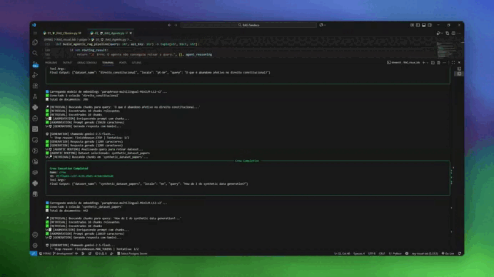

# Laboratório Visual de RAG

Este projeto é uma aplicação Streamlit interativa e didática, projetada como uma ferramenta de ensino para visualizar os principais conceitos de **Retrieval-Augmented Generation (RAG)** e suas variações. O objetivo é tornar o aprendizado de RAG mais prático, intuitivo e tangível, servindo como material de apoio visual para a mentoria do Professor Sandeco.

A aplicação evoluiu por três estágios principais, cada um construindo sobre o anterior:

1.  **RAG Clássico:** A implementação fundamental do pipeline de RAG.
2.  **RAG com Memória:** Adiciona a capacidade de manter o contexto da conversa e interagir com os 2 datasets.
3.  **RAG Agente:** Utiliza um agente de IA (CrewAI) para rotear dinamicamente as perguntas para a base de conhecimento mais apropriada.

---

## 🚀 Demonstrações

### 1. RAG Clássico
O usuário faz uma pergunta e o sistema busca em uma base de conhecimento para encontrar os trechos mais relevantes, que são então usados para gerar uma resposta.


### 2. RAG com Memória
Esta versão introduz o histórico da conversa, permitindo que o sistema entenda o contexto e responda a perguntas de acompanhamento de forma mais natural.


### 3. RAG Agente (Intelligent Routing)
A fase mais avançada, onde um agente de IA primeiro analisa a pergunta do usuário para decidir qual base de conhecimento (dataset) é a mais adequada para responder. Isso permite que o sistema lide com múltiplos domínios de conhecimento de forma inteligente.


O agente expõe seu "raciocínio" para fins didáticos, mostrando como ele chegou à decisão de qual dataset usar.



---

## 🏗️ Arquitetura e Tecnologias

A aplicação é construída como um aplicativo web monolítico renderizado no lado do servidor, utilizando uma stack focada em simplicidade e prototipagem rápida de IA.

*   **Framework Principal:** **Streamlit** para a interface do usuário, permitindo a criação de uma UI rica e interativa usando apenas Python.
*   **IA e LLMs:**
    *   **Google Gemini:** Utilizado como o modelo de linguagem principal para geração de respostas.
    *   **CrewAI:** Framework de agentes usado no módulo "RAG Agente" para orquestrar o roteamento inteligente de perguntas.
*   **Vector Store:** **ChromaDB** para armazenar os embeddings dos documentos e realizar buscas por similaridade.
*   **Memória Persistente:** **Redis** (gerenciado via Docker) para o histórico de conversas.
*   **Visualização de Dados:**
    *   **Plotly:** Para visualizações interativas, como o mapa de embeddings.
    *   **Streamlit-Agraph:** Para a renderização de grafos de conhecimento.

A estrutura do projeto segue o padrão de "Aplicativo de Múltiplas Páginas" do Streamlit, onde cada laboratório (Clássico, Memória, Agente) é um módulo independente.

---

## ⚙️ Como Executar o Projeto

Siga os passos abaixo para configurar e executar o laboratório em sua máquina local.

### Pré-requisitos
*   Python 3.12+
*   `uv` (ou `pip`) instalado
*   **Git:** Para clonar o repositório.
*   **Docker Desktop:** Essencial para rodar o Redis (a "memória" do RAG).
    *   Faça o download e instale a partir do [site oficial do Docker](https://www.docker.com/products/docker-desktop/).
    *   Após a instalação, **inicie o Docker Desktop** e aguarde até que ele esteja em execução (o ícone da baleia na sua barra de tarefas deve ficar estável).

### 1. Clone o Repositório
```bash
git clone https://github.com/matheus896/rag-visual-lab.git
```

### 2. Configure as Variáveis de Ambiente
Crie um arquivo `.env` na raiz do diretório `01RAG` a partir do exemplo fornecido.

```bash
cp .env.example .env
```
Agora, edite o arquivo `.env` e adicione sua chave de API do Google Gemini:

```env
GOOGLE_API_KEY="SUA_CHAVE_DE_API_AQUI"
```

### 3. Instale as Dependências
É recomendado usar `uv` para uma instalação mais rápida.

```bash
cd RAG_visual_lab

# Crie um ambiente virtual
uv venv 

# Ative o ambiente
# No Windows:
.venv\Scripts\activate
# No macOS/Linux:
source .venv/bin/activate

# Instale as dependências
uv sync --all-extras 
```

**Inicie o Redis com Docker:**

O Redis será a memória persistente para o nosso "RAG com Memória". O Docker torna esse processo trivial.

```bash
docker-compose up -d
```

Este comando irá baixar a imagem do Redis e iniciar um contêiner em segundo plano. Você só precisa fazer isso uma vez.

### 4. Popule as Bases de Conhecimento (ChromaDB):

Este é o passo crucial de **Indexação**. Vamos executar o script que lê os documentos, os divide em *chunks*, gera os *embeddings* e os armazena no ChromaDB.
```bash
# Execute o script para criar as bases de dados vetoriais
python semantic_encoder.py
```
*   Este script irá criar uma pasta `chroma_db` e populará as coleções `synthetic_dataset_papers` e `direito_constitucional`, que são usadas nos laboratórios.

### 5. Execute a Aplicação
Com tudo configurado, agora você pode iniciar o laboratório interativo.

```bash
streamlit run streamlit_app.py
```

Seu navegador abrirá automaticamente com a aplicação em execução.

---

## 📂 Estrutura de Arquivos (Visão Geral)

A estrutura do projeto é organizada para separar as responsabilidades e facilitar a navegação.

```
rag-visual-lab/
├── semantic_encoder.py     # 👈 SCRIPT DE INDEXAÇÃO: Execute para popular o ChromaDB
├── docker-compose.yml      # 🐳 Configuração do Redis
├── RAG_visual_lab/         # 🔬 Módulo principal do laboratório visual
│   ├── streamlit_app.py    # Entrypoint da aplicação Streamlit
│   ├── pages/              # Cada arquivo .py é uma página/laboratório
│   ├── services/           # Lógica de backend (Retriever, Memória, Agente)
│   └── utils/              # Funções de UI e processamento de texto
├── docs/                   # 📂 Documentos fonte para as bases de conhecimento
└── ...
```

## 🤝 Contribuindo

Este projeto é uma ferramenta viva para a comunidade de mentorados. Contribuições são muito bem-vindas!

1.  **Fork** o projeto.
2.  Crie uma branch para sua feature (`git checkout -b feature/MinhaNovaVisualizacao`).
3.  Faça suas alterações e commit (`git commit -m 'Adiciona visualização de grafo'`).
4.  Faça o push para a sua branch (`git push origin feature/MinhaNovaVisualizacao`).
5.  Abra um **Pull Request**.

## ✨ Agradecimentos

*   **Professor Sandeco** e toda a comunidade de mentorados.


